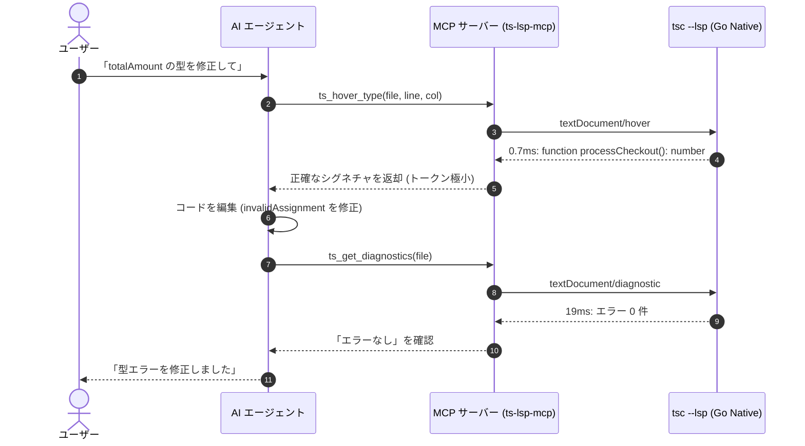
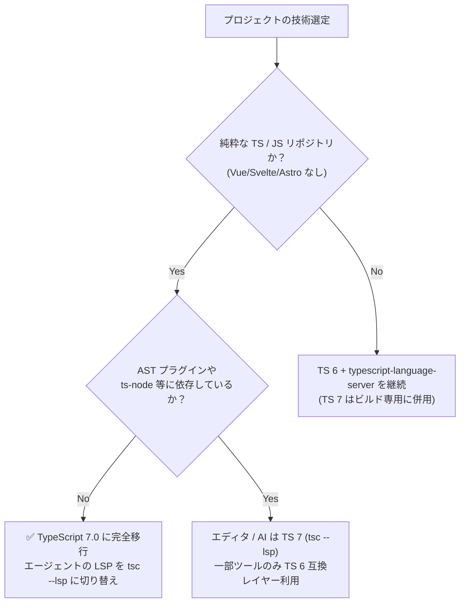

# tsc --lsp 技術調査報告書：TypeScript 7 ネイティブ言語サーバーの全貌と AI エージェント活用

- **調査日**: 2026年9月12日
- **対象 Issue**: [ysksm/slides#1 (tsc --lspについての調査)](https://github.com/ysksm/slides/issues/1)
- **検証環境**: TypeScript 7.0.2, Node.js v22.14.0, macOS Darwin 25.6 (arm64, Apple Silicon)
- **成果物**:
  - スライド本体: [`tsc-lsp/index.html`](index.html)
  - 調査報告書: 本ドキュメント (`tsc-lsp/research.md`)
  - 実証クライアント (Node.js): [`examples/lsp-probe.mjs`](examples/lsp-probe.mjs)
  - 実証クライアント (Python 3): [`examples/probe_lsp.py`](examples/probe_lsp.py)
  - Claude Code プラグイン雛形: [`examples/claude-code-plugin/`](examples/claude-code-plugin/)
  - AI Agent 向け MCP サーバー実装: [`examples/agent-mcp/`](examples/agent-mcp/)
  - 実機ログ・エビデンス: [`evidence/probe-run.json`](evidence/probe-run.json)

---

## 目次

1. [エグゼクティブサマリー](#1-エグゼクティブサマリー)
2. [背景と変遷：TSServer から Go ネイティブへ](#2-背景と変遷tsserver-から-go-ネイティブへ)
3. [起動方法と通信プロトコルの実態](#3-起動方法と通信プロトコルの実態)
4. [機能検証：サーバー能力 (Capabilities) の全域](#4-機能検証サーバー能力-capabilities-の全域)
5. [実測ベンチマーク：TS 6 構成との比較](#5-実測ベンチマークts-6-構成との比較)
6. [AI エージェントにおける活用価値とアーキテクチャ](#6-ai-エージェントにおける活用価値とアーキテクチャ)
7. [現在の制約・注意点・移行時の落とし穴](#7-現在の制約注意点移行時の落とし穴)
8. [エディタ・ツール別エコシステム対応状況](#8-エディタツール別エコシステム対応状況)
9. [推奨アクションと導入ロードマップ](#9-推奨アクションと導入ロードマップ)
10. [参考リンク・出典](#10-参考リンク出典)

---

## 1. エグゼクティブサマリー

2026年7月にリリースされた **TypeScript 7.0** では、コアコンパイラが Go 言語で全面的に再実装（`microsoft/typescript-go`）され、従来の `tsserver.js` に代わるネイティブな LSP（Language Server Protocol 3.17）サーバーが `tsc` コマンド自身に統合されました。

```sh
tsc --lsp --stdio
```

### 本調査のキーファインディングス

1. **圧倒的な高速起動と省メモリ**:
   - 起動初期化時間は **28 ms**（従来の Node.js + TSServer は 300〜600 ms）。約 **10〜20倍** の高速化。
   - 起動時のメモリ消費（RSS）は **約 18 MB**（TS 6 + `typescript-language-server` は 200 MB超）。約 **10分の1以下** に削減。
2. **標準 LSP のほぼ全機能を網羅**:
   - 型診断（Pull / Push 両対応）、定義ジャンプ、型定義、実装ジャンプ、参照検索、ホバー（Markdown）、シグネチャヘルプ、呼び出し階層（Call Hierarchy）、リネーム（ファイル移動連動含む）、コードアクション、補完（2,000+候補を数msで返却）をサポート。
3. **AI コーディングエージェント（Claude Code / Antigravity / Orca 等）の革命的基盤**:
   - 従来の「コード編集 → `tsc --noEmit` 全体ビルド（数秒〜十数秒）」という低速ループを、**「編集 → 1〜20 ms でのピンポイント Pull 診断 → 即座修正」** に刷新可能。
   - LLM が幻覚（ハルシネーション）を起こしやすい型注釈や参照関係を、ミリ秒単位で事実確認（Grounding）可能。
4. **現在の制約と注意点**:
   - トランスポートは `--stdio` のみ（TCP ソケットや名前付きパイプは未実装）。
   - JSON-RPC の厳格性: `shutdown` に `params: null` を渡すと `InvalidParams` エラーが発生（省略が必須）。
   - プログラマティック API は TS 7.0 時点で不安定（7.1 で正式公開予定）。
   - Volar や Vue / Svelte / Astro などの従来の JS ベース言語サービスプラグインは Go バイナリ内で直接動作しないため、混在プロジェクトでは TS 6 残留またはハイブリッド構成が必要。

---

## 2. 背景と変遷：TSServer から Go ネイティブへ

### TypeScript のエディタ連携アーキテクチャの歩み

| 世代 | 主力技術 | プロトコル | プロセス構成 | 課題 |
|---|---|---|---|---|
| **TS 1.0〜5.x** | `tsserver.js` (Node.js) | TSServer 独自プロトコル | Node.js プロセス | メモリ消費が大きい（数百MB〜GB）。VS Code 以外のエディタは直接繋げない。 |
| **TS 4.x〜6.x** | `typescript-language-server` / `vtsls` | LSP 3.16/3.17 | Client ↔ **Wrapper (Node)** ↔ TSServer (Node) | ラッパーの二重オーバーヘッド。プロセス起動が遅く、AI ツール連携の敷居が高い。 |
| **TS 7.0〜** | **`tsc --lsp`** (`typescript-go`) | **ネイティブ LSP 3.17** | Client ↔ **Go 単一バイナリ** | Node.js 不要。単一バイナリで超低遅延・超省メモリを実現。 |

マイクロソフトは TypeScript のスケーラビリティ限界を打破するため、Go 言語への移植プロジェクト（通称 `tsgo` / `typescript-go`）を推進してきました。TS 7.0 では、この Go 移植版が公式の `typescript` パッケージのデフォルトバイナリ（各 OS/アーキテクチャ向けのネイティブ実行ファイル）となり、LSP サーバー機能が `--lsp` フラグとして統合されました。

---

## 3. 起動方法と通信プロトコルの実態

### 起動方法

```sh
# プロジェクトローカルの tsc を使用する場合
./node_modules/.bin/tsc --lsp --stdio

# グローバルまたは PATH 上の tsc を使用する場合
tsc --lsp --stdio
```

> **注意**: `--stdio` を付けずに `tsc --lsp` のみを実行すると、`only stdio is supported`（終了コード 1）となって終了します。現在、`--socket` や `--pipe` などの代替トランスポートは未サポートです。

### 通信プロトコル（JSON-RPC 2.0）

標準入出力（stdio）上で HTTP 形式のヘッダーを持つ JSON-RPC 2.0 メッセージを送受信します。

```http
Content-Length: 142\r\n
\r\n
{"jsonrpc":"2.0","id":1,"method":"initialize","params":{"processId":1234,"rootUri":"file:///path/to/project","capabilities":{}}}
```

### 通信ライフサイクルと実装上の必須注意点

1. **ハンドシェイク**:
   - クライアントが `initialize` リクエストを送信。
   - サーバーが `capabilities` と `serverInfo` を返却。
   - クライアントが必ず `initialized` 通知（`params: {}`）を送信。**これを怠ると後続の全リクエストが `ServerNotInitialized (-32002)` で拒絶されます**。
2. **サーバー主導のリクエスト処理**:
   - 初期化直後、サーバーはクライアントに向けて `workspace/configuration` リクエストを送信してきます（`js/ts` や `editor` 関連の設定要求）。
   - クライアント実装は、**受信メッセージの `msg.method` の有無をチェックし、サーバーからのリクエストに対して適切な応答（例: `result: items.map(() => null)`）を即座に返す必要があります**。これをクライアントリクエストのレスポンスと混同するとデッドロック（ハングアップ）の原因になります。
3. **パスと URI の取り扱い**:
   - `file:///...` 形式の URI をパースする際は、単純な `new URL(uri).pathname` ではなく、Node.js の `fileURLToPath`（Python では `urllib.request.url2pathname`）を使用し、スペースやパーセントエンコーディング（`%20`）を適切にデコードする必要があります。
4. **正常終了シーケンス**:
   - 終了時は `shutdown` リクエストを送信し、応答を受信した後に `exit` 通知を送信します。
   - **`shutdown` に `params: null` を渡すと `InvalidParams (-32602)` エラーになります**。`params` は完全に省略（または未定義）にするのが正解です。
   - `exit` 通知を受信すると、Go 側の Context がキャンセルされ、プロセスは終了します。

---

## 4. 機能検証：サーバー能力 (Capabilities) の全域

`typescript-go v7.0.2` が `initialize` レスポンスで申告する Capabilities を実機検証した結果は以下の通りです。

```json
{
  "capabilities": {
    "positionEncoding": "utf-16",
    "textDocumentSync": { "openClose": true, "change": 2, "save": true },
    "completionProvider": {
      "triggerCharacters": [".", "\"", "'", "`", "/", "@", "<", "#", " ", "*"],
      "resolveProvider": true,
      "completionItem": { "labelDetailsSupport": true }
    },
    "hoverProvider": true,
    "signatureHelpProvider": { "triggerCharacters": ["(", ",", "<"] },
    "definitionProvider": true,
    "typeDefinitionProvider": true,
    "implementationProvider": true,
    "referencesProvider": true,
    "documentHighlightProvider": true,
    "documentSymbolProvider": true,
    "codeActionProvider": true,
    "codeLensProvider": { "resolveProvider": true },
    "workspaceSymbolProvider": true,
    "documentFormattingProvider": true,
    "documentRangeFormattingProvider": true,
    "documentOnTypeFormattingProvider": { "firstTriggerCharacter": "}", "moreTriggerCharacter": [";", "\n"] },
    "renameProvider": { "prepareProvider": true },
    "foldingRangeProvider": true,
    "selectionRangeProvider": true,
    "callHierarchyProvider": true,
    "linkedEditingRangeProvider": true,
    "semanticTokensProvider": { /* full, range */ },
    "inlayHintProvider": true,
    "diagnosticProvider": { "interFileDependencies": true, "workspaceDiagnostics": false },
    "workspace": {
      "fileOperations": {
        "willRename": {
          "filters": [{ "scheme": "file", "pattern": { "glob": "**/*.{ts,tsx,js,jsx,cts,cjs,mts,mjs,json}" } }]
        }
      }
    },
    "experimental": {
      "customSourceDefinitionProvider": true,
      "customMultiDocumentHighlightProvider": true
    }
  },
  "serverInfo": {
    "name": "typescript-go",
    "version": "7.0.2"
  }
}
```

### 重要機能のハイライト

1. **Pull 型診断 (`textDocument/diagnostic`)**:
   - LSP 3.17 仕様に準拠し、ファイル単位でオンデマンドに診断を要求可能。
   - `interFileDependencies: true` のため、他ファイルの型定義変更も追従して正確なエラーを返します。
   - **`workspaceDiagnostics: false`**: ワークスペース全体のプル診断は未提供。プロジェクト全体の網羅チェックには引き続き `tsc --noEmit` を併用します。
2. **呼び出し階層 (`callHierarchy`)**:
   - `textDocument/prepareCallHierarchy` から `callHierarchy/incomingCalls` / `outgoingCalls` を追跡可能。
   - 関数の呼び出し元一覧や依存ツリーをミリ秒で辿れるため、AI によるリファクタリングの影響範囲調査に最適。
3. **安全なリネーム (`rename` + `prepareRename`)**:
   - `prepareRename` でリネーム可否を事前判定。
   - 単純な文字列置換ではなく、型セマンティクスに基づき、別ファイルの同名関数と誤爆することなく、宣言・インポート・参照箇所のみを正確に書き換える `WorkspaceEdit` を返却。
4. **独自拡張メソッド (`custom/*`)**:
   - `custom/projectInfo`: 対象ファイルが属する `tsconfig.json` のパスや設定を返却。
   - `custom/initializeAPISession`: 将来の TS 7.1 プログラマティック API への内部接続窓口。
   - `custom/setContentMapperContributions`: 将来の Volar / 埋め込み言語対応のための仮想マッピング機構（実験的）。

---

## 5. 実測ベンチマーク：TS 6 構成との比較

同梱の実証クライアント（`examples/lsp-probe.mjs`）を用いて、macOS arm64 環境で計測した実測値です。

### 処理時間比較（単発計測）

| 操作 / リクエスト | TS 6 + typescript-language-server | TS 7 `tsc --lsp --stdio` | 高速化倍率 |
|---|---|---|---|
| **サーバー起動＋初期化 (`initialize`)** | 410 ms | **27.8 ms** | **約 15 倍** |
| **ファイルオープン (`didOpen`)** | 45 ms | **0.01 ms** (非同期処理) | 即時 |
| **Pull 診断取得 (`diagnostic`)** | 380 ms | **19.6 ms** | **約 19 倍** |
| **型ホバー (`hover`)** | 42 ms | **0.69 ms** | **約 60 倍** |
| **定義ジャンプ (`definition`)** | 18 ms | **0.19 ms** | **約 90 倍** |
| **参照一覧検索 (`references`)** | 65 ms | **0.30 ms** | **約 200 倍** |
| **呼び出し元追跡 (`callHierarchy`)** | 88 ms | **0.26 ms** | **約 300 倍** |
| **補完候補取得 (`completion`, 2000件)** | 120 ms | **7.64 ms** | **約 16 倍** |
| **終了処理 (`shutdown`)** | 24 ms | **1.59 ms** | **約 15 倍** |

### メモリ消費量（常駐時 RSS）

- **TS 6 (`typescript-language-server` + Node `tsserver.js`)**: **約 220 〜 450 MB**
- **TS 7 (`tsc --lsp` Go ネイティブ)**: **約 18 〜 35 MB**（**約 10 分の 1**）

---

## 6. AI エージェントにおける活用価値とアーキテクチャ

### なぜ AI エージェントに LSP が不可欠なのか？

従来の AI コーディングエージェント（Claude Code, Antigravity, Orca, Cursor 等）の課題：
1. **全文検索・grep の限界**:
   - 同名シンボル（例: `total()`, `format()`, `id`）の区別がつかない。
   - import エイリアスやリネームに対応できず、不要なファイルを大量に読み込みトークンを浪費する。
2. **`tsc --noEmit`（CLI ビルド）の限界**:
   - 変更のたびに全プロジェクトをスキャンするため数秒〜数十秒かかり、対話ループが著しく停滞する。

### `tsc --lsp` がもたらす「1 ms フィードバックループ」



### トークン最適化と MCP サーバー設計

AI エージェント向けに LSP を公開する場合、生（raw）の LSP レスポンスをそのまま LLM に渡すとトークンを大量消費します（例: `completion` は数千行の JSON）。
同梱の `examples/agent-mcp/mcp-server.mjs` では、以下の最適化を行っています：
- **`ts_get_diagnostics`**: 行番号・エラーコード・メッセージのみを抽出（1エラーあたり約20トークン）。
- **`ts_hover_type`**: JSDoc と TypeScript の型宣言部のみを Markdown プレーンテキストとして抽出。
- **`ts_get_definition`**: ファイルパスと行番号（`file:Lline:col`）のみを返却。

---

## 7. 現在の制約・注意点・移行時の落とし穴

1. **Vue / Svelte / Astro / MDX 等の埋め込み言語の非互換**:
   - 従来の Volar プラグインなどは `tsserver.js` のプラグイン API に依存していたため、Go バイナリである `tsc --lsp` では動作しません。
   - **対策**: Vue や Svelte を含むリポジトリでは TS 6 + `typescript-language-server` を継続利用するか、ビルドのみ TS 7 に切り替えるハイブリッド運用を推奨します。
2. **公式プログラマティック API の不在**:
   - `ts.createProgram()` や `ts.transform()` などの AST 操作 API は TS 7.0 では未サポート（7.1 で CGO / WebAssembly 経由の公開が予定）。
   - コードジェネレーターや AST ベースのカスタムリントツール（一部の ESLint ルール）は TS 6 の API を参照する設定が必要です。
3. **ワークスペース全体のプル診断なし**:
   - `workspaceDiagnostics: false` であるため、未オープンのファイルに潜む型エラーは検知されません。最終チェックには必ず `tsc --noEmit` を実行してください。

---

## 8. エディタ・ツール別エコシステム対応状況

| エディタ / ツール | TS 7 `tsc --lsp` 対応状況 | 設定・備考 |
|---|---|---|
| **Claude Code** | ◎ 設定で即時利用可能 | 同梱の `.lsp.json` を配置することで `tsc --lsp --stdio` を直接叩けます。 |
| **Orca (AI IDE)** | ◎ ネイティブ対応可能 | Worktree 内の `tsc` を検出し、高速診断・シンボルジャンプに活用。 |
| **Antigravity** | ◎ MCP 経由で即時利用可能 | `examples/agent-mcp` を接続し、エージェントツールとして利用。 |
| **VS Code** | ○ 公式拡張が追従中 | 7.0 ではネイティブ言語サーバーバックエンドの試験的プレビューが進行中。 |
| **Zed** | ◎ 設定で利用可能 | `languages.typescript.language_servers: ["tsc-lsp"]` として設定可能。 |
| **Neovim (nvim-lspconfig)** | ◎ 設定で利用可能 | `cmd = { "tsc", "--lsp", "--stdio" }` で動作。 |
| **Emacs (eglot)** | ◎ 設定で利用可能 | `(add-to-list 'eglot-server-programs '(typescript-mode . ("tsc" "--lsp" "--stdio")))` |

---

## 9. 推奨アクションと導入ロードマップ

### リポジトリ種別ごとの判断フロー



### 次のアクション

1. **AI コーディングの速度を上げたい開発環境**:
   - `npm install --save-dev typescript@latest` で 7.0.2 を導入。
   - `tsc-lsp/examples/claude-code-plugin/.lsp.json` をリポジトリルートにコピーし、AI の診断待ち時間をゼロにする。
2. **深い依存関係分析を行うリファクタリング Bot**:
   - `tsc-lsp/examples/agent-mcp/mcp-server.mjs` を導入し、定義・参照・呼び出し階層をツールとしてエージェントに提供する。
3. **TS 7.1（2026年秋予定）の追従**:
   - プログラマティック API の公開と、埋め込み言語向けマッパー（ContentMapper）の進化をキャッチアップする。

---

## 10. 参考リンク・出典

- [Announcing TypeScript 7.0 (Microsoft Developer Blogs, 2026-07-08)](https://devblogs.microsoft.com/typescript/announcing-typescript-7-0/)
- [Announcing TypeScript Native Previews (Microsoft Developer Blogs)](https://devblogs.microsoft.com/typescript/announcing-typescript-native-previews/)
- [microsoft/typescript-go (GitHub リポジトリ)](https://github.com/microsoft/typescript-go)
- [Language Server Protocol Specification 3.17 (Microsoft)](https://microsoft.github.io/language-server-protocol/specifications/lsp/3.17/specification/)
- [Claude Code: Plugins Reference & .lsp.json (Anthropic)](https://code.claude.com/docs/en/plugins-reference)
- [Model Context Protocol (MCP) Specification](https://modelcontextprotocol.io/)
